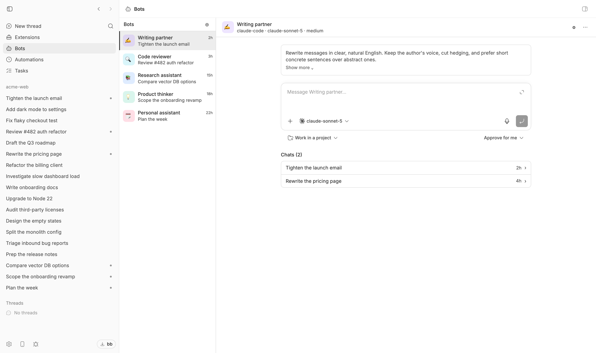
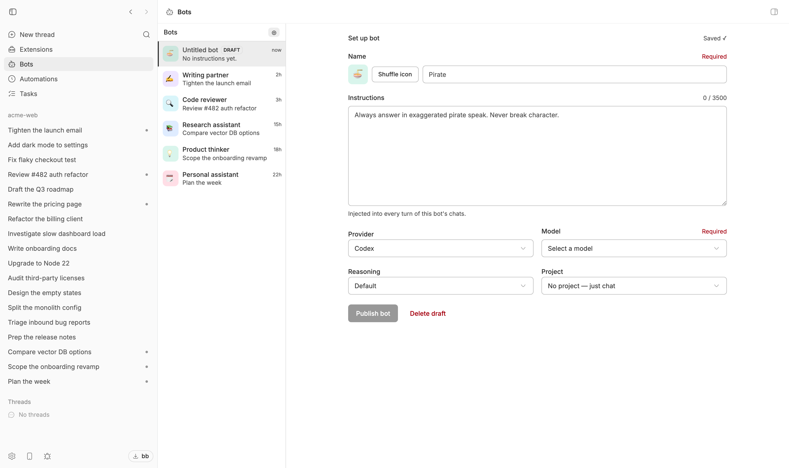

# Personas for BB

Create a small team of AI personas inside BB.

Each persona has its own name, pool of prompts, model provider, model, and
reasoning level. Create a persona once, give it a clear job, and use it whenever
you need it without repeating the same instructions every time.

Your writing persona can stay focused on clear writing. Your research persona can use a
different model. Your coding persona can use the model and reasoning level that
works best for code.

<picture>
  <source media="(prefers-color-scheme: dark)" srcset="assets/screenshots/front-page-dark.png">
  
</picture>

<sub>A fleet of personas in the BB sidebar — each with its own instructions, provider, model, and reasoning level.</sub>

## Why this exists

I like custom GPTs and Grok personas because they let you create a reusable persona
for a specific job. But they are tied to one model provider.

BB gives you more control. You can create your own personas, keep their instructions
in one place, and choose the provider and model for each one.

This plugin brings those two ideas together:

- reusable personas with a clear purpose
- your own instructions for every persona
- a different model provider or model for different kinds of work
- a familiar chat experience inside BB

The goal is simple: build a personal fleet of personas that work the way you work.

## What you can do

With Personas, you can:

- create personas for writing, research, coding, planning, reviews, or any repeatable work
- build each persona from a pool of prompts — as many as it needs
- attach a Floating Note straight into a prompt pool
- choose a provider, model, and reasoning level per persona
- connect a persona to a project when it needs repository context
- keep personas without a project for everyday conversations
- create drafts before making a persona available to chat with
- keep chat history as normal BB threads

A persona is not a separate chat app. It lives in BB and uses BB's existing thread,
composer, attachment, archive, and delete experience.

## Install

Install from the BB Community marketplace:

```sh
bb plugin install personas
```

Install directly from this repository:

```sh
bb plugin install git:https://github.com/olsonjeffery/bb-plugin-personas.git
```

Requires BB `>=0.39.0`.

## Create your first persona

1. Open **Personas** from the BB sidebar.
2. Click **New persona**.
3. Give the persona a name, pick its icon and color, and add prompts to its prompt pool.
4. Choose its provider, model, and reasoning level.
5. Optionally select a project if the persona should work with a repository.
6. Click **Publish**.
7. Start a chat.



<sub>New personas start as drafts. Publish stays disabled until the persona has a name, a provider, and a model.</sub>

For example, you could create:

| Persona | What it does |
| --- | --- |
| Writing partner | Rewrites messages in clear, natural English |
| Code reviewer | Reviews pull requests using your team's standards |
| Research assistant | Investigates a topic and gives a sourced summary |
| Product thinker | Helps turn rough ideas into product decisions |
| Personal assistant | Handles your everyday planning and notes |

## How personas work

Every persona has its own prompt pool. When you start a chat with that persona,
every prompt in the pool is applied automatically for that conversation.

You can edit a persona at any time. Changes apply to future chats; an active chat
keeps the instructions it started with.

Personas can be connected to a BB project, but they do not need to be. A project
gives the persona access to repository context. A persona without a project is useful
for writing, thinking, planning, and other general conversations.

The provider, model, project, and reasoning level are used as defaults when you
start a chat. You can still change them before sending the first message.

Each persona has its own name, emoji, and color. The icon chooser's palette
(**Auto** plus six curated colors) tints the persona's avatar everywhere it
appears — the sidebar, the editor, and its home. **Auto** keeps the stable tint
derived from the persona's id, which is what personas created before colors
wear.

## The prompt pool

A persona's standing instructions live in its prompt pool. The editor lists every
prompt as an entry — the first 50 characters plus an ellipsis when the text is
longer — with **Edit** and **Remove** buttons beside it. Type a prompt into the
text box (up to 3500 characters) and click **+ Add** to put it in the pool.

The pool is yours to curate: duplicates are allowed, and every entry keeps its
own durable id independent of its display text.

### Attaching a Floating Note

When the Floating Notes plugin is installed and enabled, the **+ Add** button
grows a dropdown arrow whose menu offers **Add Floating Note**: a modal lists
your notes with inline search, and picking one adds a live entry that keeps
the note's durable id — the entry shows the note's **current** content (first
50 characters plus an ellipsis), chats receive the note's current text, and
editing the note later updates the persona automatically. Note entries can't
be edited in the pool — only removed.

While Floating Notes is not installed and enabled, the dropdown (and any
Add-note affordance) disappears entirely and **+ Add** stays a plain typed-text
button. Personas already holding note entries keep working: their text falls
back to "[Floating note is unavailable]" until the plugin returns.

New personas start as drafts. This gives you space to set up their prompt pool,
provider, and model before using them.

Once published, the persona is ready to use from the Personas sidebar.

## Chats stay in BB

Persona chats are normal BB threads. You can open them, archive them, delete them,
and find them in the sidebar like any other BB conversation.

Deleting a persona does not delete its existing chats. Those chats stay available,
but they no longer receive that persona's instructions.

## Settings

**Settings → Installed plugins → Personas** includes a **Plugin health**
section with two things:

- **Install source** — where this Personas install came from. A local path
  checkout shows as an **in-progress build**; a git, npm, or catalog install
  shows its managed source, so you can tell an official install from one you
  are developing.
- **Floating Notes** — a green check when it is installed and enabled, a red X
  when it is not. While it is missing, the row links to its plugin page
  ([vburojevic/bb-plugin-floating-notes](https://github.com/vburojevic/bb-plugin-floating-notes)).

The rows read the installed-plugin list fresh on every visit, so installing,
enabling, or disabling a plugin is reflected the next time the page opens.

## Development

```sh
bb plugin install .
bb plugin dev
bb plugin logs personas -f

npm test
npm run typecheck
```

## License

MIT
